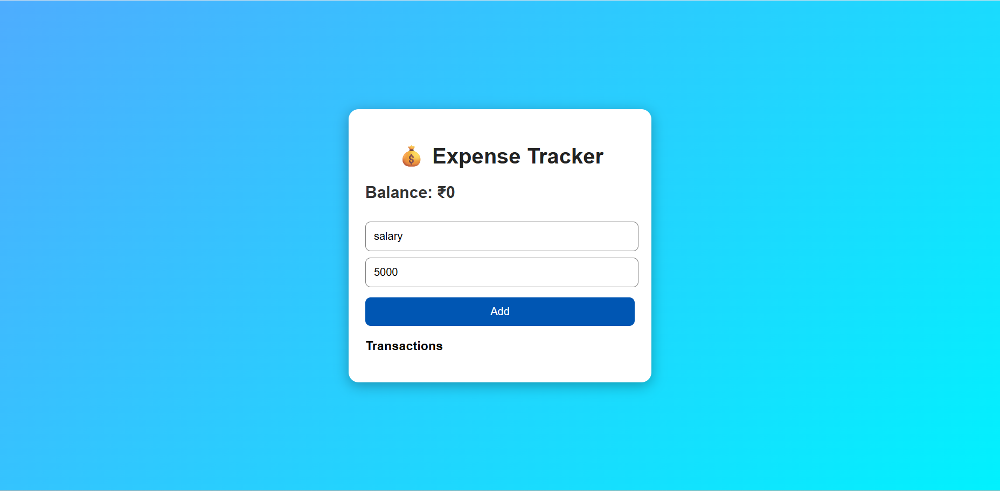

# 💰 Expense Tracker React App

A simple and stylish Expense Tracker built using React.js.

---

## 🚀 Features

- Add Transactions
- Delete Transactions
- Dynamic Balance Calculation
- Responsive UI Design
- React Hooks (useState)

---

## 🛠️ Technologies Used

- React.js
- JavaScript
- HTML
- CSS

---

## 📸 Project Screenshot



---

## ▶️ Run Locally

```bash
npm install
npm start
```

---

## 🔗 GitHub Repository

https://github.com/Suman1-panda/expense-tracker-react
